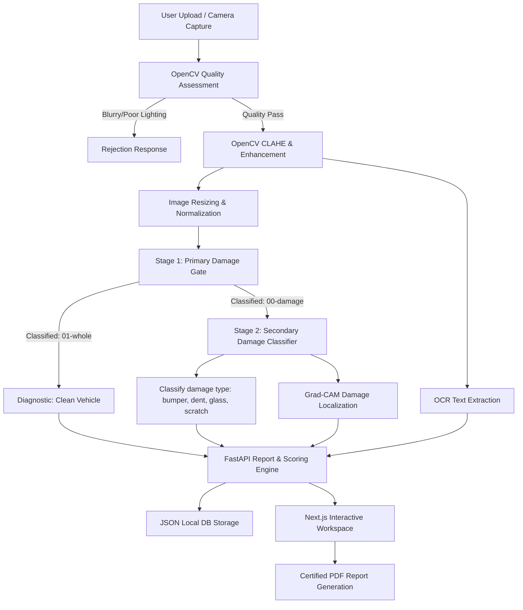

# ValidAuto: AI-Powered Vehicle Damage Assessment Platform

ValidAuto is an end-to-end, academic-grade full-stack software system designed to automate visual vehicle inspections. The platform leverages advanced computer vision, deep learning transfer learning, and digital image processing to detect vehicle body damage, classify specific damage types, estimate Indian Rupee (₹)-based repair costs, and generate certified PDF inspection reports.

Developed as a decoupled application with a **Next.js (App Router, TypeScript, Tailwind CSS)** frontend and a **FastAPI (Python)** backend, the platform features a real-time visual inspection scanner, interactive dashboards, and comprehensive analysis modules that can be presented directly to project examiners.

---

## 🛠️ System Architecture

The application implements a multi-stage pipeline combining digital image processing, binary convolutional neural network (CNN) gating, multi-class classification, OCR metadata extraction, and class-activation mapping (Grad-CAM).

### Architectural Workflow Diagram



### Decoupled Component Stack

1. **Frontend (Next.js + TypeScript)**: Renders a glassmorphic dashboard using customized CSS animations. It includes a real-time webcam scanner, multi-step progress indicators, and local/database sync modules.
2. **Backend (FastAPI)**: Serves model prediction, image enhancement, and JSON database storage APIs.
3. **ML Classifier Engine (TensorFlow/Keras)**: Employs two independent pre-trained MobileNetV2 networks serving as primary and secondary diagnostic layers.
4. **Data Layer (JSON File DB)**: Dynamically saves report sessions in `backend/app/db/` to ensure histories can be reloaded.

---

## 📂 Folder Structure

```
samsungProject/
├── .gitignore                   # Excludes dependencies, virtual environments, datasets, and local databases
├── README.md                    # Top-level system documentation & presentation guide
├── backend/
│   ├── app/
│   │   ├── main.py              # FastAPI application server, endpoint logic, and image processing pipeline
│   │   ├── report.py            # Diagnostic report template generator
│   │   ├── ocr.py               # OCR engine using Tesseract/EasyOCR fallback hooks
│   │   ├── train.py             # Training pipeline for primary damage model
│   │   ├── train_secondary.py   # Training pipeline for secondary damage type model
│   │   ├── vehicle_damage_model.h5   # Saved weights for primary binary model
│   │   └── secondary_damage_model.h5 # Saved weights for secondary multi-class model
│   ├── requirements.txt         # Backend Python packages (TensorFlow, OpenCV, FastAPI, etc.)
│   ├── run.py                   # FastAPI server entry point
│   └── venv/                    # Isolated Python virtual environment (ignored)
└── frontend/
    ├── public/                  # Static assets and generated performance graphs
    │   ├── accuracy_graph.png   # Training loss/accuracy curve (from train.py)
    │   ├── confusion_matrix.png # True vs Predicted matrix (from train.py)
    │   └── car_scan.jpg         # Default mock scanning asset
    ├── src/
    │   ├── app/
    │   │   ├── page.tsx         # Hero landing page
    │   │   ├── analysis/        # Visual inspection scan workspace
    │   │   ├── history/         # Scanning session logs database page
    │   │   ├── analytics/       # Fleet diagnostic chart analytics dashboard
    │   │   ├── about/           # Technical stack details & model graphs
    │   │   ├── globals.css      # Core Tailwind styling and canvas setups
    │   │   └── layout.tsx       # Layout context wrapping navigation, headers, and SEO
    │   └── components/
    │       ├── UploadCard.tsx   # Interactive drag-and-drop workspace panel
    │       └── Navbar.tsx       # Custom header navigation
```

---

## 🧠 Machine Learning Pipelines & Dataset Details

ValidAuto uses a **two-stage computer vision workflow** to minimize false positives and enhance diagnostic specificity:

### 1. Model Stages & Classification Targets

| Model Stage | Filename | Classes | Description |
| :--- | :--- | :--- | :--- |
| **Stage 1: Primary Gate** | [`vehicle_damage_model.h5`](file:///C:/Users/aadit/OneDrive/Desktop/samsungProject/backend/app/vehicle_damage_model.h5) | `00-damage`<br>`01-whole` | Performs initial binary classification. If `01-whole` is predicted, the pipeline skips further ML steps, reporting a clean vehicle. If `00-damage`, the image is routed to Stage 2. |
| **Stage 2: Secondary Classifier** | [`secondary_damage_model.h5`](file:///C:/Users/aadit/OneDrive/Desktop/samsungProject/backend/app/secondary_damage_model.h5) | `bumper`<br>`dent`<br>`glass`<br>`scratch` | Identifies the specific vehicle damage category and estimates the confidence score. |

---

### 2. Dataset Specifics

#### Dataset A: Kaggle Vehicle Damage Dataset (Primary Gate)
* **Path**: Located locally in [`data1a/`](file:///C:/Users/aadit/OneDrive/Desktop/samsungProject/data1a) (Ignored by Git).
* **Format**: Split into `/training` and `/validation` folders.
* **Sub-directories**:
  * `00-damage/`: Images of cars with dents, scratches, structural deformations, or cracks.
  * `01-whole/`: Images of clean, undamaged cars from various angles.

#### Dataset B: Secondary Damage Dataset (Multi-Class Model)
* **Path**: Located locally in [`data_secondary/`](file:///C:/Users/aadit/OneDrive/Desktop/samsungProject/data_secondary) (Ignored by Git).
* **Format**: Split into `/training` and `/validation` folders.
* **Sub-directories**:
  * `bumper/`: Scrapes, detachment, or dents localized to rear/front bumpers.
  * `dent/`: Body panel deformations, door dings, and sheet metal depressions.
  * `glass/`: Windshield cracks, bullseye stars, and side window fractures.
  * `scratch/`: Surface abrasions, clear-coat scratches, and key marks.

---

### 3. Hyperparameters & Preprocessing

The model training pipeline (implemented in [`train.py`](file:///C:/Users/aadit/OneDrive/Desktop/samsungProject/backend/app/train.py) and [`train_secondary.py`](file:///C:/Users/aadit/OneDrive/Desktop/samsungProject/backend/app/train_secondary.py)) incorporates the following operations:

* **Image Resizing**: Input images are reshaped to $224 \times 224 \times 3$ to align with MobileNetV2 inputs.
* **Input Scaling**: Normalizes pixel values dynamically to a range of $[-1.0, 1.0]$ via a Rescaling layer:
  $$\text{Pixel}_{\text{scaled}} = \frac{\text{Pixel}}{127.5} - 1.0$$
* **Data Augmentation**: To prevent overfitting and assist in general classification, the dataset undergoes real-time training augmentations:
  * `RandomFlip("horizontal")`
  * `RandomRotation(factor=0.1)` (up to $\pm 36^\circ$)
  * `RandomContrast(factor=0.1)`
* **Feature Extractor Base**: MobileNetV2 pre-trained on the ImageNet dataset with frozen base layers:
  $$\mathbf{x}_{\text{base}} = f_{\text{MobileNetV2}}(\mathbf{x}_{\text{input}})$$
* **Classifier Top Layer**:
  * `GlobalAveragePooling2D()`: Flattens the feature map spatial components.
  * `Dropout(0.3)`: Dropout regularization to prevent overfitting.
  * `Dense(Softmax)`: Dense output layer mapping to class probabilities.
* **Training Optimizers**:
  * **Optimizer**: Adam with learning rate $\eta = 0.001$.
  * **Loss Function**: `SparseCategoricalCrossentropy`.
  * **Epochs**: Up to 15, managed with early-stopping callbacks.
  * **Callbacks**: `ModelCheckpoint` (saving best validation accuracy), `EarlyStopping` (patience = 5), and `ReduceLROnPlateau` (reducing learning rate when validation loss stalls).

---

## 📷 Computer Vision & Image Engineering Features

The backend pipeline includes several advanced image processing steps implemented in [`main.py`](file:///C:/Users/aadit/OneDrive/Desktop/samsungProject/backend/app/main.py):

### 1. OpenCV Quality Assessment & Validation
To ensure diagnostic reliability, the system evaluates:
* **Exposure / Brightness**: Rejects images where average pixel intensity is $< 40$ (under-exposed) or $> 250$ (over-exposed).
* **Blur Check**: Computes the Laplacian variance:
  $$\sigma^2 = \text{Var}\left(\nabla^2 I\right)$$
  If the variance is below $100.0$, the image is rejected as blurry.
* **Contrast Check**: Evaluates standard deviation of pixel intensities; values below $15.0$ trigger rejection.

### 2. Automatic Image Enhancement
Before feeding the image to the neural networks, the system applies:
* **CLAHE (Contrast Limited Adaptive Histogram Equalization)**: Equalizes contrast locally to highlight minor scratches.
* **Gaussian Denoising**: Removes sensor noise and compression artifacts.
* **Laplacian Sharpening**: Sharpens fine edges to assist key damage boundaries.

### 3. Grad-CAM Damage Localization
For explainable AI (XAI), the backend extracts activations from the final convolutional layer of MobileNetV2 (`Conv_1` or equivalent layer) and computes gradients relative to the predicted class score:
$$L^c_{\text{Grad-CAM}} = \text{ReLU}\left(\sum_k \alpha_k^c A^k\right)$$
This produces a heatmap highlighting the exact region leading to the classification decision, which is then superimposed on the image.

### 4. OCR Vehicle Metadata Extraction
The system scans the uploaded image using optical character recognition (OCR) to detect license plate numbers, vehicle identification numbers (VINs), and registration tags, automatically pre-filling the diagnostic report.

---

## 🚀 Setup & Execution Guide

Follow these steps to run the full-stack system locally:

### Step 1: Run the Backend (FastAPI)
1. Navigate to the backend directory:
   ```bash
   cd backend
   ```
2. Set up and activate a Python 3.11+ virtual environment:
   ```powershell
   python -m venv venv
   # Activate on Windows Powershell:
   .\venv\Scripts\Activate.ps1
   # Activate on macOS/Linux:
   source venv/bin/activate
   ```
3. Install the dependencies:
   ```bash
   pip install -r requirements.txt
   ```
4. Run the FastAPI development server:
   ```bash
   python run.py
   ```
   *The server starts on `http://127.0.0.1:8000`.*

### Step 2: Run the Frontend (Next.js)
1. Open a new terminal and navigate to the frontend directory:
   ```bash
   cd frontend
   ```
2. Install npm dependencies:
   ```bash
   npm install
   ```
3. Start the Next.js development server:
   ```bash
   npm run dev
   ```
   *The client application starts on `http://localhost:3000`.*

### Step 3: (Optional) Retrain the Machine Learning Models
If you want to recreate the model weights or update the graphs, execute:
```bash
# From the backend directory
python app/train.py             # Trains Stage 1 model and saves accuracy_graph.png
python app/train_secondary.py   # Trains Stage 2 model
```

---

## 🎓 Examiner Presentation Guide

To present this project to your examiners, follow this workflow to demonstrate each technical component:

### 1. Introduction & Abstract (Landing Page)


### 2. Live Camera Scanner (Interactive Capture)


### 3. Pipeline Execution (Checklist Loader)


### 4. Explainable AI & Report Generation (Results Page)


### 5. Historical Audit Logs (History & Analytics Dashboard)


